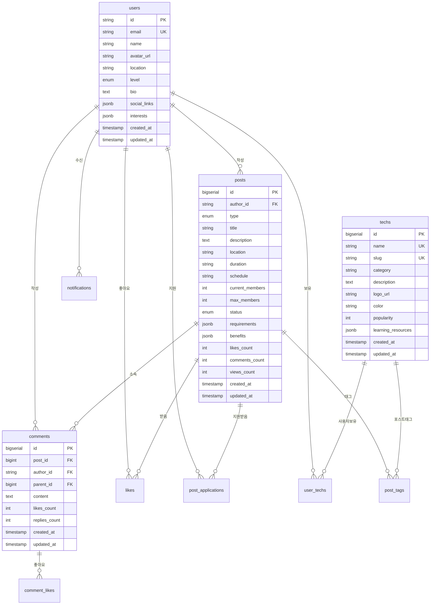

# 📊 Stackload 데이터 모델 설계

## 🎯 데이터베이스 설계 개요

Stackload 프로젝트의 데이터는 사용자, 커뮤니티 포스트, 기술 스택, 댓글, 알림 등으로 구성됩니다. PostgreSQL을 사용하여 관계형 데이터와 JSON 데이터를 효율적으로 관리합니다.

## 🏗️ 전체 데이터베이스 구조



## 📋 테이블별 상세 설계

### 1. 👤 users (사용자)

사용자의 기본 정보와 프로필을 저장합니다.

```sql
CREATE TABLE users (
  id TEXT PRIMARY KEY,                    -- NextAuth에서 생성하는 고유 ID
  email TEXT UNIQUE NOT NULL,             -- 이메일 (로그인용)
  name TEXT NOT NULL,                     -- 사용자명
  avatar_url TEXT,                        -- 프로필 이미지 URL
  location TEXT,                          -- 거주 지역
  level TEXT NOT NULL DEFAULT 'Beginner' -- 개발 레벨
    CHECK (level IN ('Beginner', 'Junior', 'Mid-Level', 'Senior', 'Expert', 'Student')),
  bio TEXT,                               -- 자기소개
  social_links JSONB DEFAULT '{}',        -- 소셜 링크 (GitHub, Discord, 이메일)
  interests JSONB DEFAULT '[]',           -- 관심 분야 (배열)
  
  -- 통계 정보 (계산된 값, 트리거로 업데이트)
  posts_count INTEGER DEFAULT 0,
  likes_received_count INTEGER DEFAULT 0,
  comments_count INTEGER DEFAULT 0,
  
  -- 타임스탬프
  created_at TIMESTAMP WITH TIME ZONE DEFAULT NOW(),
  updated_at TIMESTAMP WITH TIME ZONE DEFAULT NOW()
);

-- 인덱스
CREATE INDEX idx_users_email ON users(email);
CREATE INDEX idx_users_level ON users(level);
CREATE INDEX idx_users_location ON users(location);
```

**JSONB 필드 구조:**
```json
// social_links 예시
{
  "github": "https://github.com/username",
  "discord": "username#1234",
  "email": "user@example.com"
}

// interests 예시
["웹 개발", "AI/ML", "클라우드", "오픈소스"]
```

### 2. 📝 posts (커뮤니티 포스트)

프로젝트, 스터디, 멘토링 모집 게시글을 저장합니다.

```sql
CREATE TABLE posts (
  id BIGSERIAL PRIMARY KEY,               -- 게시글 고유 ID
  author_id TEXT NOT NULL                 -- 작성자 ID
    REFERENCES users(id) ON DELETE CASCADE,
  
  -- 게시글 기본 정보
  type TEXT NOT NULL                      -- 포스트 유형
    CHECK (type IN ('project', 'study', 'mentoring')),
  title TEXT NOT NULL,                    -- 제목
  description TEXT NOT NULL,              -- 상세 설명 (마크다운 지원)
  
  -- 모집 관련 정보
  location TEXT DEFAULT '온라인',          -- 진행 장소
  duration TEXT,                          -- 예상 기간 (예: "3개월")
  schedule TEXT,                          -- 정기 일정 (예: "매주 화요일 저녁 9시")
  current_members INTEGER DEFAULT 1,      -- 현재 참여자 수
  max_members INTEGER NOT NULL,           -- 최대 참여자 수
  
  status TEXT NOT NULL DEFAULT 'recruiting' -- 모집 상태
    CHECK (status IN ('recruiting', 'in_progress', 'completed', 'closed')),
  
  -- JSON 필드
  requirements JSONB DEFAULT '[]',        -- 지원 요구사항 (문자열 배열)
  benefits JSONB DEFAULT '[]',           -- 참여 혜택 (문자열 배열)
  
  -- 통계 정보
  likes_count INTEGER DEFAULT 0,
  comments_count INTEGER DEFAULT 0,
  views_count INTEGER DEFAULT 0,
  applications_count INTEGER DEFAULT 0,
  
  -- 타임스탬프
  created_at TIMESTAMP WITH TIME ZONE DEFAULT NOW(),
  updated_at TIMESTAMP WITH TIME ZONE DEFAULT NOW()
);

-- 인덱스
CREATE INDEX idx_posts_author_id ON posts(author_id);
CREATE INDEX idx_posts_type ON posts(type);
CREATE INDEX idx_posts_status ON posts(status);
CREATE INDEX idx_posts_created_at ON posts(created_at DESC);
CREATE INDEX idx_posts_location ON posts(location);
```

**JSONB 필드 구조:**
```json
// requirements 예시
[
  "React/Next.js 실무 경험 6개월 이상",
  "TypeScript 사용 가능",
  "팀 프로젝트 경험",
  "매주 정기 미팅 참석 가능"
]

// benefits 예시
[
  "포트폴리오 제작 지원",
  "코드 리뷰 및 멘토링", 
  "실무 경험 쌓기",
  "네트워킹 기회"
]
```

### 3. 🛠️ techs (기술 스택)

기술, 프레임워크, 도구 정보를 저장합니다.

```sql
CREATE TABLE techs (
  id BIGSERIAL PRIMARY KEY,               -- 기술 고유 ID
  name TEXT UNIQUE NOT NULL,              -- 기술명 (예: "React")
  slug TEXT UNIQUE NOT NULL,              -- URL용 슬러그 (예: "react")
  category TEXT NOT NULL,                 -- 카테고리
  description TEXT,                       -- 간단한 설명
  
  -- 시각적 요소
  logo_url TEXT,                          -- 로고 이미지 URL
  color TEXT DEFAULT '#6B7280',          -- 대표 색상 (헥스 코드)
  
  -- 메타 정보
  popularity INTEGER DEFAULT 0,           -- 인기도 점수
  learning_resources JSONB DEFAULT '[]',  -- 학습 자료 링크
  
  -- 타임스탬프
  created_at TIMESTAMP WITH TIME ZONE DEFAULT NOW(),
  updated_at TIMESTAMP WITH TIME ZONE DEFAULT NOW()
);

-- 인덱스
CREATE INDEX idx_techs_category ON techs(category);
CREATE INDEX idx_techs_popularity ON techs(popularity DESC);
CREATE INDEX idx_techs_name ON techs(name);
CREATE INDEX idx_techs_slug ON techs(slug);
```

**JSONB 필드 구조:**
```json
// learning_resources 예시
[
  {
    "title": "React 공식 문서",
    "url": "https://reactjs.org/docs",
    "type": "documentation"
  },
  {
    "title": "React 초보자 튜토리얼",
    "url": "https://example.com/tutorial",
    "type": "tutorial"
  }
]
```

### 4. 💬 comments (댓글)

게시글에 대한 댓글과 대댓글을 저장합니다.

```sql
CREATE TABLE comments (
  id BIGSERIAL PRIMARY KEY,               -- 댓글 고유 ID
  post_id BIGINT NOT NULL                 -- 게시글 ID
    REFERENCES posts(id) ON DELETE CASCADE,
  author_id TEXT NOT NULL                 -- 작성자 ID
    REFERENCES users(id) ON DELETE CASCADE,
  parent_id BIGINT                        -- 부모 댓글 ID (대댓글용)
    REFERENCES comments(id) ON DELETE CASCADE,
  
  content TEXT NOT NULL,                  -- 댓글 내용
  
  -- 통계 정보
  likes_count INTEGER DEFAULT 0,
  replies_count INTEGER DEFAULT 0,       -- 대댓글 수
  
  -- 타임스탬프
  created_at TIMESTAMP WITH TIME ZONE DEFAULT NOW(),
  updated_at TIMESTAMP WITH TIME ZONE DEFAULT NOW()
);

-- 인덱스
CREATE INDEX idx_comments_post_id ON comments(post_id);
CREATE INDEX idx_comments_author_id ON comments(author_id);
CREATE INDEX idx_comments_parent_id ON comments(parent_id);
CREATE INDEX idx_comments_created_at ON comments(created_at);
```

### 5. ❤️ likes (좋아요)

사용자가 게시글에 누른 좋아요를 저장합니다.

```sql
CREATE TABLE likes (
  id BIGSERIAL PRIMARY KEY,
  user_id TEXT NOT NULL                   -- 좋아요 누른 사용자
    REFERENCES users(id) ON DELETE CASCADE,
  post_id BIGINT NOT NULL                 -- 좋아요 받은 게시글
    REFERENCES posts(id) ON DELETE CASCADE,
  
  created_at TIMESTAMP WITH TIME ZONE DEFAULT NOW(),
  
  -- 유니크 제약조건 (한 사용자당 게시글 하나에 하나의 좋아요만)
  UNIQUE(user_id, post_id)
);

-- 인덱스
CREATE INDEX idx_likes_user_id ON likes(user_id);
CREATE INDEX idx_likes_post_id ON likes(post_id);
```

### 6. 💬❤️ comment_likes (댓글 좋아요)

댓글에 대한 좋아요를 저장합니다.

```sql
CREATE TABLE comment_likes (
  id BIGSERIAL PRIMARY KEY,
  user_id TEXT NOT NULL                   -- 좋아요 누른 사용자
    REFERENCES users(id) ON DELETE CASCADE,
  comment_id BIGINT NOT NULL              -- 좋아요 받은 댓글
    REFERENCES comments(id) ON DELETE CASCADE,
  
  created_at TIMESTAMP WITH TIME ZONE DEFAULT NOW(),
  
  -- 유니크 제약조건
  UNIQUE(user_id, comment_id)
);
```

### 7. 👥 post_applications (프로젝트 참여 신청)

사용자가 프로젝트에 참여 신청한 내역을 저장합니다.

```sql
CREATE TABLE post_applications (
  id BIGSERIAL PRIMARY KEY,
  post_id BIGINT NOT NULL                 -- 신청한 게시글
    REFERENCES posts(id) ON DELETE CASCADE,
  applicant_id TEXT NOT NULL              -- 신청자
    REFERENCES users(id) ON DELETE CASCADE,
  
  -- 신청 내용
  motivation TEXT NOT NULL,               -- 참여 동기
  experience TEXT NOT NULL,               -- 관련 경험
  availability TEXT NOT NULL,             -- 참여 가능 시간
  portfolio_url TEXT,                     -- 포트폴리오 링크
  
  -- 상태 관리
  status TEXT NOT NULL DEFAULT 'pending' -- 신청 상태
    CHECK (status IN ('pending', 'approved', 'rejected')),
  
  -- 검토 정보
  reviewed_by TEXT                        -- 검토자 (팀장)
    REFERENCES users(id) ON DELETE SET NULL,
  reviewed_at TIMESTAMP WITH TIME ZONE,   -- 검토 일시
  review_message TEXT,                    -- 검토 메시지
  
  -- 타임스탬프
  created_at TIMESTAMP WITH TIME ZONE DEFAULT NOW(),
  updated_at TIMESTAMP WITH TIME ZONE DEFAULT NOW(),
  
  -- 유니크 제약조건 (한 사용자당 하나의 게시글에 하나의 신청만)
  UNIQUE(post_id, applicant_id)
);

-- 인덱스
CREATE INDEX idx_post_applications_post_id ON post_applications(post_id);
CREATE INDEX idx_post_applications_applicant_id ON post_applications(applicant_id);
CREATE INDEX idx_post_applications_status ON post_applications(status);
```

### 8. 🏷️ post_tags (게시글 기술 태그)

게시글과 기술 스택의 다대다 관계를 관리합니다.

```sql
CREATE TABLE post_tags (
  id BIGSERIAL PRIMARY KEY,
  post_id BIGINT NOT NULL                 -- 게시글 ID
    REFERENCES posts(id) ON DELETE CASCADE,
  tech_id BIGINT NOT NULL                 -- 기술 ID
    REFERENCES techs(id) ON DELETE CASCADE,
  
  created_at TIMESTAMP WITH TIME ZONE DEFAULT NOW(),
  
  -- 유니크 제약조건
  UNIQUE(post_id, tech_id)
);

-- 인덱스
CREATE INDEX idx_post_tags_post_id ON post_tags(post_id);
CREATE INDEX idx_post_tags_tech_id ON post_tags(tech_id);
```

### 9. 👤🛠️ user_techs (사용자 기술 스택)

사용자가 보유한 기술 스택을 관리합니다.

```sql
CREATE TABLE user_techs (
  id BIGSERIAL PRIMARY KEY,
  user_id TEXT NOT NULL                   -- 사용자 ID
    REFERENCES users(id) ON DELETE CASCADE,
  tech_name TEXT NOT NULL,                -- 기술명 (단순 문자열로 관리)
  
  -- 숙련도 (선택사항, 향후 확장용)
  proficiency_level INTEGER DEFAULT 1    -- 1-5 레벨
    CHECK (proficiency_level >= 1 AND proficiency_level <= 5),
  
  created_at TIMESTAMP WITH TIME ZONE DEFAULT NOW(),
  
  -- 유니크 제약조건
  UNIQUE(user_id, tech_name)
);

-- 인덱스
CREATE INDEX idx_user_techs_user_id ON user_techs(user_id);
CREATE INDEX idx_user_techs_tech_name ON user_techs(tech_name);
```

### 10. 🔔 notifications (알림)

사용자에게 보낼 알림을 저장합니다.

```sql
CREATE TABLE notifications (
  id BIGSERIAL PRIMARY KEY,
  recipient_id TEXT NOT NULL              -- 알림 받을 사용자
    REFERENCES users(id) ON DELETE CASCADE,
  
  -- 알림 내용
  type TEXT NOT NULL,                     -- 알림 유형
  title TEXT NOT NULL,                    -- 알림 제목
  message TEXT NOT NULL,                  -- 알림 내용
  
  -- 관련 엔티티 (선택사항)
  related_post_id BIGINT                  -- 관련 게시글
    REFERENCES posts(id) ON DELETE SET NULL,
  related_user_id TEXT                    -- 관련 사용자
    REFERENCES users(id) ON DELETE SET NULL,
  
  -- 상태 관리
  is_read BOOLEAN DEFAULT FALSE,          -- 읽음 여부
  read_at TIMESTAMP WITH TIME ZONE,       -- 읽은 시간
  
  -- 타임스탬프
  created_at TIMESTAMP WITH TIME ZONE DEFAULT NOW()
);

-- 인덱스
CREATE INDEX idx_notifications_recipient_id ON notifications(recipient_id);
CREATE INDEX idx_notifications_is_read ON notifications(is_read);
CREATE INDEX idx_notifications_type ON notifications(type);
CREATE INDEX idx_notifications_created_at ON notifications(created_at DESC);
```

### 11. 🔖 bookmarks (북마크) - 향후 확장용

```sql
CREATE TABLE bookmarks (
  id BIGSERIAL PRIMARY KEY,
  user_id TEXT NOT NULL                   -- 북마크한 사용자
    REFERENCES users(id) ON DELETE CASCADE,
  post_id BIGINT NOT NULL                 -- 북마크된 게시글
    REFERENCES posts(id) ON DELETE CASCADE,
  
  created_at TIMESTAMP WITH TIME ZONE DEFAULT NOW(),
  
  -- 유니크 제약조건
  UNIQUE(user_id, post_id)
);
```

## 🔄 트리거 및 함수

통계 정보를 자동으로 업데이트하는 트리거들을 설정합니다.

### 1. 게시글 좋아요 수 업데이트

```sql
-- 게시글 좋아요 수 업데이트 함수
CREATE OR REPLACE FUNCTION update_post_likes_count()
RETURNS TRIGGER AS $$
BEGIN
  IF TG_OP = 'INSERT' THEN
    UPDATE posts 
    SET likes_count = likes_count + 1 
    WHERE id = NEW.post_id;
    RETURN NEW;
  ELSIF TG_OP = 'DELETE' THEN
    UPDATE posts 
    SET likes_count = likes_count - 1 
    WHERE id = OLD.post_id;
    RETURN OLD;
  END IF;
  RETURN NULL;
END;
$$ LANGUAGE plpgsql;

-- 트리거 생성
CREATE TRIGGER trigger_post_likes_count
  AFTER INSERT OR DELETE ON likes
  FOR EACH ROW
  EXECUTE FUNCTION update_post_likes_count();
```

### 2. 댓글 수 업데이트

```sql
-- 게시글 댓글 수 업데이트 함수
CREATE OR REPLACE FUNCTION update_post_comments_count()
RETURNS TRIGGER AS $$
BEGIN
  IF TG_OP = 'INSERT' THEN
    UPDATE posts 
    SET comments_count = comments_count + 1 
    WHERE id = NEW.post_id;
    RETURN NEW;
  ELSIF TG_OP = 'DELETE' THEN
    UPDATE posts 
    SET comments_count = comments_count - 1 
    WHERE id = OLD.post_id;
    RETURN OLD;
  END IF;
  RETURN NULL;
END;
$$ LANGUAGE plpgsql;

-- 트리거 생성
CREATE TRIGGER trigger_post_comments_count
  AFTER INSERT OR DELETE ON comments
  FOR EACH ROW
  EXECUTE FUNCTION update_post_comments_count();
```

### 3. updated_at 자동 업데이트

```sql
-- updated_at 자동 업데이트 함수
CREATE OR REPLACE FUNCTION update_updated_at_column()
RETURNS TRIGGER AS $$
BEGIN
  NEW.updated_at = NOW();
  RETURN NEW;
END;
$$ LANGUAGE plpgsql;

-- 필요한 테이블에 트리거 적용
CREATE TRIGGER trigger_users_updated_at
  BEFORE UPDATE ON users
  FOR EACH ROW
  EXECUTE FUNCTION update_updated_at_column();

CREATE TRIGGER trigger_posts_updated_at
  BEFORE UPDATE ON posts
  FOR EACH ROW
  EXECUTE FUNCTION update_updated_at_column();
```

## 📊 Prisma 스키마 파일

위 SQL을 Prisma 스키마로 변환한 버전입니다.

```prisma
// prisma/schema.prisma
generator client {
  provider = "prisma-client-js"
}

datasource db {
  provider  = "postgresql"
  url       = env("POSTGRES_PRISMA_URL")
  directUrl = env("POSTGRES_URL_NON_POOLING")
}

model User {
  id        String   @id @default(cuid())
  email     String   @unique
  name      String
  avatarUrl String?  @map("avatar_url")
  location  String?
  level     UserLevel @default(Beginner)
  bio       String?
  
  // JSON 필드
  socialLinks Json     @default("{}") @map("social_links")
  interests   Json     @default("[]")
  
  // 통계 정보
  postsCount         Int @default(0) @map("posts_count")
  likesReceivedCount Int @default(0) @map("likes_received_count")
  commentsCount      Int @default(0) @map("comments_count")
  
  // 관계
  posts              Post[]
  comments           Comment[]
  likes              Like[]
  commentLikes       CommentLike[]
  postApplications   PostApplication[] @relation("Applicant")
  reviewedApplications PostApplication[] @relation("Reviewer")
  notifications      Notification[]
  userTechs          UserTech[]
  bookmarks          Bookmark[]
  
  createdAt DateTime @default(now()) @map("created_at")
  updatedAt DateTime @updatedAt @map("updated_at")
  
  @@map("users")
}

enum UserLevel {
  Beginner
  Junior
  @map("Mid-Level")
  MidLevel
  Senior
  Expert
  Student
}

model Post {
  id             BigInt    @id @default(autoincrement())
  authorId       String    @map("author_id")
  type           PostType
  title          String
  description    String
  location       String    @default("온라인")
  duration       String?
  schedule       String?
  currentMembers Int       @default(1) @map("current_members")
  maxMembers     Int       @map("max_members")
  status         PostStatus @default(recruiting)
  
  // JSON 필드
  requirements Json @default("[]")
  benefits     Json @default("[]")
  
  // 통계 정보
  likesCount        Int @default(0) @map("likes_count")
  commentsCount     Int @default(0) @map("comments_count")
  viewsCount        Int @default(0) @map("views_count")
  applicationsCount Int @default(0) @map("applications_count")
  
  // 관계
  author       User              @relation(fields: [authorId], references: [id], onDelete: Cascade)
  comments     Comment[]
  likes        Like[]
  applications PostApplication[]
  tags         PostTag[]
  notifications Notification[]
  bookmarks    Bookmark[]
  
  createdAt DateTime @default(now()) @map("created_at")
  updatedAt DateTime @updatedAt @map("updated_at")
  
  @@map("posts")
}

enum PostType {
  project
  study
  mentoring
}

enum PostStatus {
  recruiting
  @map("in_progress")
  inProgress
  completed
  closed
}

model Tech {
  id          BigInt @id @default(autoincrement())
  name        String @unique
  slug        String @unique
  category    String
  description String?
  logoUrl     String? @map("logo_url")
  color       String  @default("#6B7280")
  popularity  Int     @default(0)
  
  // JSON 필드
  learningResources Json @default("[]") @map("learning_resources")
  
  // 관계
  postTags PostTag[]
  
  createdAt DateTime @default(now()) @map("created_at")
  updatedAt DateTime @updatedAt @map("updated_at")
  
  @@map("techs")
}

model Comment {
  id        BigInt  @id @default(autoincrement())
  postId    BigInt  @map("post_id")
  authorId  String  @map("author_id")
  parentId  BigInt? @map("parent_id")
  content   String
  
  // 통계 정보
  likesCount   Int @default(0) @map("likes_count")
  repliesCount Int @default(0) @map("replies_count")
  
  // 관계
  post         Post          @relation(fields: [postId], references: [id], onDelete: Cascade)
  author       User          @relation(fields: [authorId], references: [id], onDelete: Cascade)
  parent       Comment?      @relation("CommentReplies", fields: [parentId], references: [id], onDelete: Cascade)
  replies      Comment[]     @relation("CommentReplies")
  commentLikes CommentLike[]
  
  createdAt DateTime @default(now()) @map("created_at")
  updatedAt DateTime @updatedAt @map("updated_at")
  
  @@map("comments")
}

model Like {
  id     BigInt @id @default(autoincrement())
  userId String @map("user_id")
  postId BigInt @map("post_id")
  
  user User @relation(fields: [userId], references: [id], onDelete: Cascade)
  post Post @relation(fields: [postId], references: [id], onDelete: Cascade)
  
  createdAt DateTime @default(now()) @map("created_at")
  
  @@unique([userId, postId])
  @@map("likes")
}

model CommentLike {
  id        BigInt @id @default(autoincrement())
  userId    String @map("user_id")
  commentId BigInt @map("comment_id")
  
  user    User    @relation(fields: [userId], references: [id], onDelete: Cascade)
  comment Comment @relation(fields: [commentId], references: [id], onDelete: Cascade)
  
  createdAt DateTime @default(now()) @map("created_at")
  
  @@unique([userId, commentId])
  @@map("comment_likes")
}

model PostApplication {
  id           BigInt                    @id @default(autoincrement())
  postId       BigInt                    @map("post_id")
  applicantId  String                    @map("applicant_id")
  motivation   String
  experience   String
  availability String
  portfolioUrl String?                   @map("portfolio_url")
  status       PostApplicationStatus    @default(pending)
  reviewedBy   String?                   @map("reviewed_by")
  reviewedAt   DateTime?                 @map("reviewed_at")
  reviewMessage String?                  @map("review_message")
  
  post      Post  @relation(fields: [postId], references: [id], onDelete: Cascade)
  applicant User  @relation("Applicant", fields: [applicantId], references: [id], onDelete: Cascade)
  reviewer  User? @relation("Reviewer", fields: [reviewedBy], references: [id], onDelete: SetNull)
  
  createdAt DateTime @default(now()) @map("created_at")
  updatedAt DateTime @updatedAt @map("updated_at")
  
  @@unique([postId, applicantId])
  @@map("post_applications")
}

enum PostApplicationStatus {
  pending
  approved
  rejected
}

model PostTag {
  id     BigInt @id @default(autoincrement())
  postId BigInt @map("post_id")
  techId BigInt @map("tech_id")
  
  post Post @relation(fields: [postId], references: [id], onDelete: Cascade)
  tech Tech @relation(fields: [techId], references: [id], onDelete: Cascade)
  
  createdAt DateTime @default(now()) @map("created_at")
  
  @@unique([postId, techId])
  @@map("post_tags")
}

model UserTech {
  id               BigInt @id @default(autoincrement())
  userId           String @map("user_id")
  techName         String @map("tech_name")
  proficiencyLevel Int    @default(1) @map("proficiency_level")
  
  user User @relation(fields: [userId], references: [id], onDelete: Cascade)
  
  createdAt DateTime @default(now()) @map("created_at")
  
  @@unique([userId, techName])
  @@map("user_techs")
}

model Notification {
  id            BigInt    @id @default(autoincrement())
  recipientId   String    @map("recipient_id")
  type          String
  title         String
  message       String
  relatedPostId BigInt?   @map("related_post_id")
  relatedUserId String?   @map("related_user_id")
  isRead        Boolean   @default(false) @map("is_read")
  readAt        DateTime? @map("read_at")
  
  recipient   User  @relation(fields: [recipientId], references: [id], onDelete: Cascade)
  relatedPost Post? @relation(fields: [relatedPostId], references: [id], onDelete: SetNull)
  
  createdAt DateTime @default(now()) @map("created_at")
  
  @@map("notifications")
}

model Bookmark {
  id     BigInt @id @default(autoincrement())
  userId String @map("user_id")
  postId BigInt @map("post_id")
  
  user User @relation(fields: [userId], references: [id], onDelete: Cascade)
  post Post @relation(fields: [postId], references: [id], onDelete: Cascade)
  
  createdAt DateTime @default(now()) @map("created_at")
  
  @@unique([userId, postId])
  @@map("bookmarks")
}
```

## 🌱 시드 데이터 준비

개발 환경에서 사용할 초기 데이터를 준비합니다.

```typescript
// prisma/seed.ts
import { PrismaClient } from '@prisma/client'

const prisma = new PrismaClient()

async function main() {
  // 기술 스택 데이터
  const techs = await prisma.tech.createMany({
    data: [
      {
        name: 'React',
        slug: 'react',
        category: 'frontend',
        description: '사용자 인터페이스 구축을 위한 JavaScript 라이브러리',
        logoUrl: 'https://cdn.jsdelivr.net/gh/devicons/devicon/icons/react/react-original.svg',
        color: '#61DAFB',
        popularity: 95,
        learningResources: [
          {
            title: 'React 공식 문서',
            url: 'https://reactjs.org/docs',
            type: 'documentation'
          }
        ]
      },
      {
        name: 'Next.js',
        slug: 'nextjs',
        category: 'frontend',
        description: 'React 기반 프로덕션 프레임워크',
        logoUrl: 'https://cdn.jsdelivr.net/gh/devicons/devicon/icons/nextjs/nextjs-original.svg',
        color: '#000000',
        popularity: 90
      },
      // 더 많은 기술 스택...
    ],
    skipDuplicates: true
  })

  // 테스트 사용자 생성
  const testUser = await prisma.user.create({
    data: {
      id: 'test-user-1',
      email: 'test@example.com',
      name: '김개발',
      location: '서울, 대한민국',
      level: 'MidLevel',
      bio: '3년차 풀스택 개발자입니다.',
      socialLinks: {
        github: 'https://github.com/testuser',
        discord: 'testuser#1234'
      },
      interests: ['웹 개발', 'AI/ML', '클라우드']
    }
  })

  // 테스트 게시글 생성
  const testPost = await prisma.post.create({
    data: {
      authorId: testUser.id,
      type: 'project',
      title: 'Next.js 13 실시간 채팅 앱 프로젝트 팀원 모집',
      description: '실시간 채팅 애플리케이션을 함께 개발할 팀원을 찾습니다.',
      maxMembers: 4,
      requirements: [
        'React/Next.js 실무 경험 6개월 이상',
        'TypeScript 사용 가능'
      ],
      benefits: [
        '포트폴리오 제작 지원',
        '코드 리뷰 및 멘토링'
      ]
    }
  })

  console.log('시드 데이터 생성 완료!')
}

main()
  .catch((e) => {
    console.error(e)
    process.exit(1)
  })
  .finally(async () => {
    await prisma.$disconnect()
  })
```

## 🚀 데이터베이스 설정 단계

### 1. Prisma 초기 설정

```bash
# Prisma 설치
npm install prisma @prisma/client

# Prisma 초기화
npx prisma init
```

### 2. 스키마 파일 작성

위의 Prisma 스키마를 `prisma/schema.prisma`에 작성합니다.

### 3. 데이터베이스 생성 및 마이그레이션

```bash
# 데이터베이스에 스키마 적용
npx prisma db push

# 또는 마이그레이션 생성
npx prisma migrate dev --name init

# Prisma 클라이언트 생성
npx prisma generate
```

### 4. 시드 데이터 실행

```bash
# package.json에 추가
{
  "prisma": {
    "seed": "tsx prisma/seed.ts"
  }
}

# 시드 실행
npx prisma db seed
```

### 5. 데이터베이스 관리 도구

```bash
# Prisma Studio 실행 (GUI 도구)
npx prisma studio
```

## 📈 성능 최적화 고려사항

### 1. 인덱싱 전략
- 자주 조회되는 필드에 인덱스 생성
- 복합 인덱스 고려 (예: `[type, status, created_at]`)
- JSONB 필드의 특정 키에 인덱스 생성

### 2. 쿼리 최적화
- N+1 쿼리 문제 방지를 위한 include/select 사용
- 페이지네이션 구현
- 필요한 필드만 선택하여 데이터 전송량 최소화

### 3. 캐싱 전략
- 자주 조회되는 데이터 Redis 캐싱
- 기술 스택 정보 등 정적 데이터 캐싱
- API 응답 캐싱

## 🔒 보안 고려사항

### 1. 데이터 접근 제어
- Row Level Security (RLS) 설정
- 사용자별 데이터 접근 권한 제한
- API 레벨에서 권한 검증

### 2. 데이터 검증
- Prisma 스키마 레벨 검증
- API 레벨에서 입력 데이터 검증
- XSS 방지를 위한 HTML 이스케이핑

### 3. 개인정보 보호
- 민감한 정보 암호화
- GDPR 준수를 위한 데이터 삭제 기능
- 로그에서 개인정보 제외

이 데이터 모델을 기반으로 안정적이고 확장 가능한 Stackload 플랫폼을 구축할 수 있습니다. 각 테이블은 명확한 역할을 가지고 있으며, 관계형 데이터와 JSON 데이터를 효율적으로 활용하여 복잡한 커뮤니티 기능을 지원합니다.